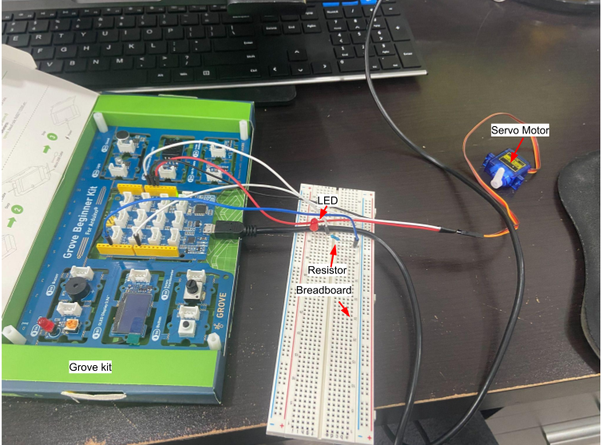
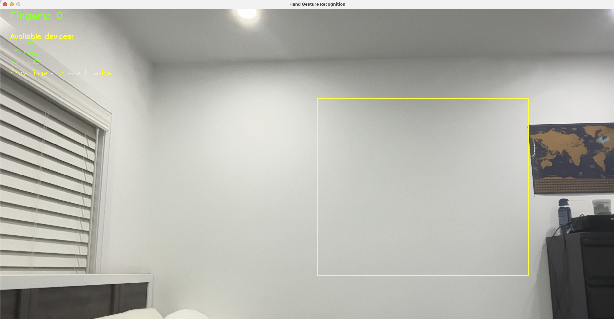
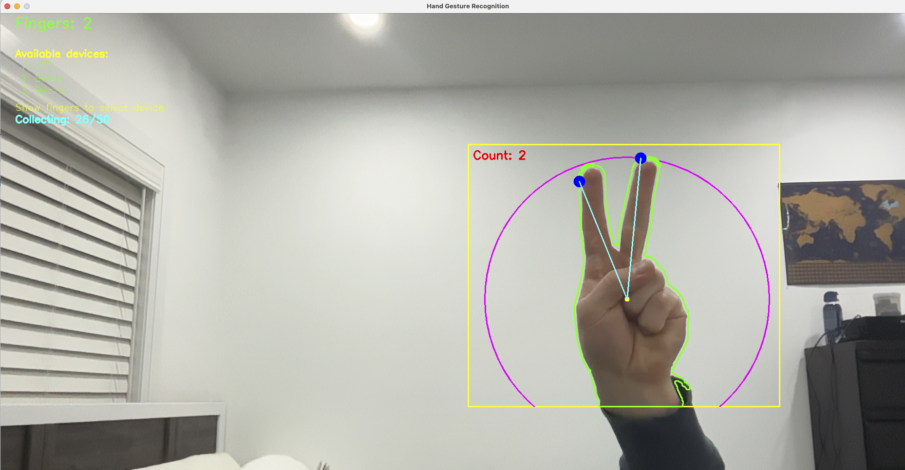
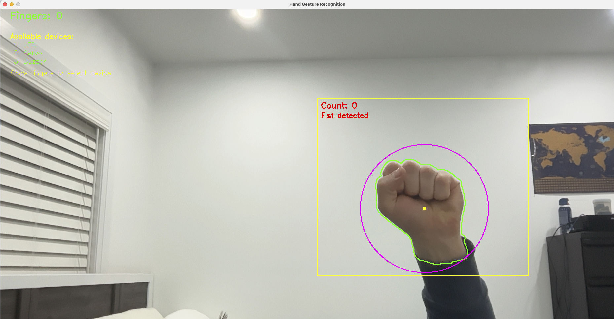
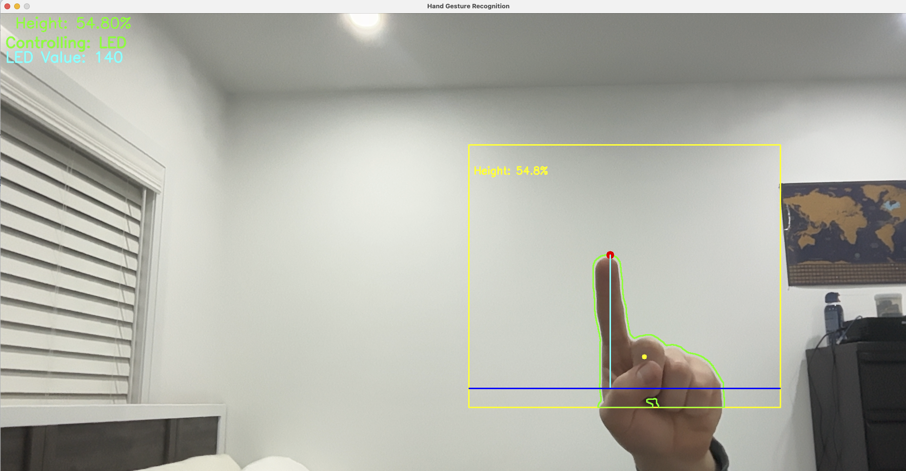

# ✋ Hand Gesture Recognition and Device Control

A Java application that uses computer vision to detect hand gestures for controlling Arduino components. The system features a camera-based interface that recognizes finger counts and hand movements to interact with various devices.

---

## 🚀 Features

- **Hand Gesture Detection**: Recognizes the number of fingers shown to select different devices
- **Device Control**: Controls LED brightness, servo motor position, and buzzer volume using hand height gestures
- **Real-time Feedback**: Visual display of recognized gestures and device control values
- **Hardware Integration**: Seamless communication with Arduino using the Firmata protocol

---

## 🧰 Hardware Requirements

- Arduino board (compatible with Firmata)
- Webcam or built-in camera
- LED connected to pin 3
- Servo motor connected to pin 9
- Buzzer connected to pin 5
- Reset button connected to pin 6

**Example Setup:**  

---

## 💻 Software Dependencies

- [OpenCV 4.1.1.0+](https://opencv.org/) for computer vision
- [firmata4j](https://github.com/kurbatov/firmata4j) for Arduino communication
- [JSSC (Java Simple Serial Connector)](https://github.com/scream3r/java-simple-serial-connector) for serial communication
- [SLF4J](http://www.slf4j.org/) for logging

---

## 🗂️ Project Structure

- **Main**: Application entry point and initialization
- **DeviceManager**: Manages interaction with connected devices
- **GestureHandler**: Processes hand gestures for device control
- **GestureDetector**: Analyzes detected fingers for consistent gesture recognition
- **GestureProcessor**: Handles the computer vision algorithms for hand detection
- **CameraManager**: Controls camera input and frame processing
- **HandGestureUI**: Handles visual interface elements
- **Device Controllers**: Individual controllers for LED, servo, and buzzer components

---

## ▶️ Usage

1. Connect your Arduino board and upload the `StandardFirmata` sketch
2. Update the `PORT` constant in `Main.java` to match your Arduino's serial port
3. Compile and run the application
4. Place your hand in the yellow box shown on the screen  
   
5. Show **1, 2, or 3 fingers** to select LED, servo, or buzzer respectively
6. Move your hand up and down to control the selected device
7. Press the reset button to return to device selection mode

---

## 🔄 Interaction Flow

- **Finger counting mode**:  
  Show fingers to select a device
    - 1 for LED
    - 2 for Servo
    - 3 for Buzzer  
        
      

- **Distance measurement mode**:  
  After selecting a device, the vertical height of your hand controls the device value
    - Higher = more brightness/volume/position  
      

- **Reset**:  
  Press the physical button to return to finger counting mode

---

## 📄 License

This project is provided for educational purposes.
